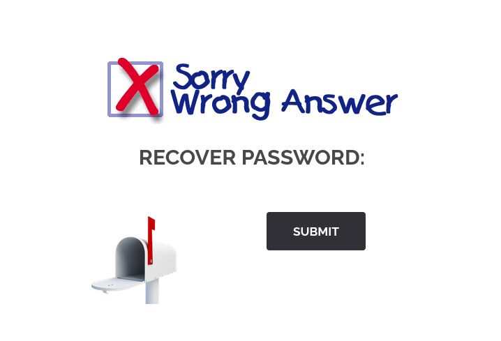
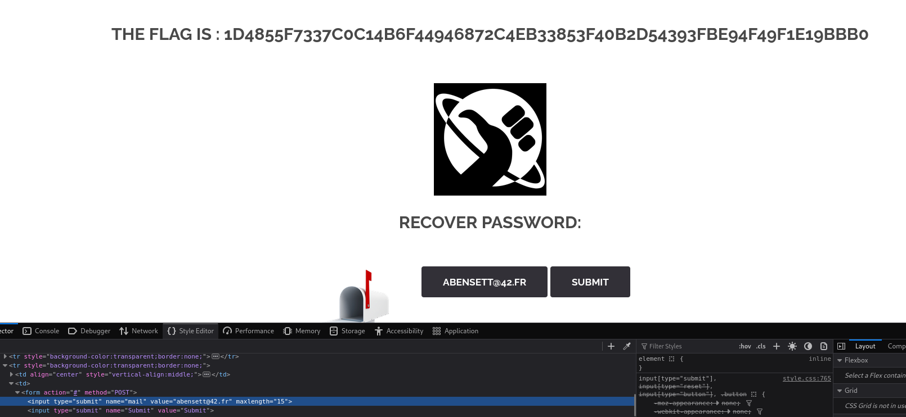

# Breach 1

## Step by Step

### 1 : Inspect page http://192.168.56.104/?page=recover#

### 2 : Change "hidden" to "submit"

 * the field mail=webmaster@borntosec.com will be sent in the POST data.

### 3 : Adding own email and modifying maxlength
* The field should not be hidden, and any input should be validated on the server side, not trusted from the client side.

## Summary
According to OWASP this vulnerabily is a :
* Hidden Field Tampering
* Web Parameter Tampering
* A01 – Broken Access Control

# Ressources 
* https://owasp.org/www-community/attacks/Web_Parameter_Tampering   