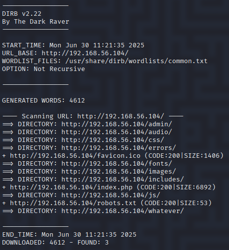

# Breach 3

## Step by Step

### 1 : Web Scan with `dirb -r http://192.168.56.104/`

|  Commande   | Signification                                                      |
| ------------------------ | ------------------------------------------------------------------ |
| `dirb`                   | Lance l'outil DIRB                                                 |
| `http://192.168.56.104/` | Cible à scanner (serveur web)                                      |
| `-r`                     | Ignore les redirections HTTP (option **"Don't follow redirects"**) |

### 2 : 

| Type       | URL trouvée                               | Code HTTP | Taille | Détails                    |
| ---------- | ----------------------------------------- | --------- | ------ | -------------------------- |
| 📁 Dossier | `http://192.168.56.104/admin/`            | —         | —      | Contient d'autres dossiers |
| 📁 Dossier | `http://192.168.56.104/audio/`            | —         | —      | Vide ou non listé          |
| 📁 Dossier | `http://192.168.56.104/css/`              | —         | —      | Contient `/images/`        |
| 📁 Dossier | `http://192.168.56.104/errors/`           | —         | —      | Vide ou non listé          |
| 📄 Fichier | `http://192.168.56.104/favicon.ico`       | 200       | 1406   | Icône du site              |
| 📁 Dossier | `http://192.168.56.104/fonts/`            | —         | —      | Vide ou non listé          |
| 📁 Dossier | `http://192.168.56.104/images/`           | —         | —      | Vide ou non listé          |
| 📁 Dossier | `http://192.168.56.104/includes/`         | —         | —      | Vide ou non listé          |
| 📄 Fichier | `http://192.168.56.104/index.php`         | 200       | 6892   | Page d’accueil             |
| 📁 Dossier | `http://192.168.56.104/js/`               | —         | —      | Vide ou non listé          |
| 📄 Fichier | `http://192.168.56.104/robots.txt`        | 200       | 53     | Peut contenir des chemins  |
| 📁 Dossier | `http://192.168.56.104/whatever/`         | —         | —      | Contient fichier sensible  |
| 📄 Fichier | `http://192.168.56.104/whatever/htpasswd` | 200       | 38     | ⚠️ Possible mot de passe   |
| 📁 Dossier | `http://192.168.56.104/admin/css/`        | —         | —      | Sous `/admin/`             |
| 📁 Dossier | `http://192.168.56.104/admin/fonts/`      | —         | —      | Sous `/admin/`             |
| 📄 Fichier | `http://192.168.56.104/admin/index.php`   | 200       | 1432   | Page d’admin               |
| 📁 Dossier | `http://192.168.56.104/css/images/`       | —         | —      | Sous `/css/`               |

### 3 : root/psswd http://192.168.56.104/whatever/

| #   | Type      | Description                                                                 |
|-----|-----------|-----------------------------------------------------------------------------|
| 1   | htpasswd  | root:437394baff5aa33daa618be47b75cb49                                        |
| 2   | CrackStation | [https://crackstation.net/](https://crackstation.net/) 437394baff5aa33daa618be47b75cb49 = qwerty123@(MD5) |
|3| http://192.168.56.104/admin/| `root:qwerty123@`

## Summary
According to OWASP, this vulnerability can be classified as:

- **A07 - Identification and Authentication Failures : Sensitive Information Exposure**: The `htpasswd` file was found in an accessible directory (`http://192.168.56.104/whatever/htpasswd`), potentially exposing sensitive authentication details such as the username and password hash for the `root` user.
  
- **Weak Passwords** &  **Potential for Privilege Escalation**  : The password found in the hash (`qwerty123@`) is a weak and easily guessable password, making it a poor security practic**e to use for critical systems. Use : bcrypt or Argon2 instead.If an attacker can crack the hash (which was found to be `qwerty123`), they could gain administrative access to the system.

- **Broken Access Control (A01) Insecure Direct Object References (IDOR)**: The `admin/` directory is accessible without proper authentication mechanisms, suggesting that directory-level security measures may be inadequate.

# Ressources 
* https://crackstation.net
*